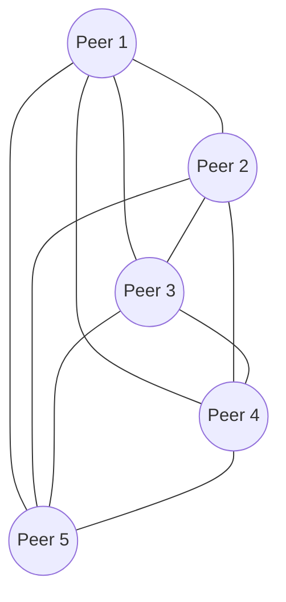

## はじめに

本記事ではブラウザで動作するビデオ通話アプリの実装方法を解説します。実装にあたってはSDKやフレームワークを利用せず、素のJavaScriptで実装します。  
対象読者はWebRTCに触れた経験のない方です。必要な知識は都度説明します。すでに理解されている項目については読み飛ばして構いません。  
本記事で実装するビデオ通話アプリはSTUN / TURN / SFUとしてCloudflare Realtimeを利用します。WebRTCの関連用語については後ほど説明しますので、ご安心ください。  

## Cloudflare Realtimeの概要

Cloudflare Realtimeはビデオ通話などのリアルタイム通信機能を実現するサービスです。以前はCloudflare Callsとよばれていましたが、2025年4月に正式リリースされ、同時にサービス名が変更されました。

リリースブログ

- [（原文）Make your apps truly interactive with Cloudflare Realtime and RealtimeKit - The Cloudflare Blog](https://blog.cloudflare.com/introducing-cloudflare-realtime-and-realtimekit/)
- [（翻訳）Cloudflare RealtimeとRealtimeKitでアプリを本当の意味でインタラクティブに - The Cloudflare Blog](https://www.google.com/search?client=safari&rls=en&q=cloudflare+realtime+release&ie=UTF-8&oe=UTF-8)。

リリースブログで言及されているRealtimeKit SDKについては本記事を投稿した時点で非公開ベータ版です。一般には提供されていません。また、本記事ではRealtimeKitの使い方について解説は行いません。  

### 公式デモアプリ「Orange Meets」

Cloudflare Realtimeを試す方法として、公式のデモアプリ「Orange Meets」は最もお手軽です。以下のURLからアクセスできます。  

https://demo.orange.cloudflare.dev

Orange MeetsはWebアプリケーションとしてCloudflare Workers上にデプロイされています。Cloudflare Realtimeを含め、完全にCloudflareスタックで構築されているのが特徴です。  
ソースコードは以下のリポジトリで公開されています。  

https://github.com/cloudflare/orange

デモアプリとはいえ、Orange Meetsは高機能で細部まで作り込まれています。どこまでがCloudflare Realtimeの機能で、どこからがアプリ固有の機能か、初見で実装を読み解くのは難しいかもしれません。  
補足すると、Orange MeetsはPartyKitとよばれるサードパーティーのSDKを利用して構築されています。PartyKitは高機能なコミュニケーション機能を提供するため、Cloudflare Realtimeの他にCloudflare Durable Objectsを利用して実装されています。  
SDKを使えば、その背後でどのようなサービスが組み合わされて機能が実現されているのか気にする必要はありません。しかし、機能不足に直面したとき、SDKの都合で実装されていないのか、Cloudflare Realtimeの仕様で実現できないのか、調査する必要に迫られます。最初にCloudflare Realtimeの概要を把握して損はありません。  

### RealtimeKitのリリースを待つべきか？

Cloudflare Realtimeが提供するのはリアルタイム通信機能を構築するための基礎となるサービスのみです。例えば、以下の機能は含まれていません。  

- ユーザー認証機能や多人数通話のルーム機能
- ノイズキャンセル機能や映像・音声の合成機能
- 録音・録画機能

その点はCloudflareも承知しているため、より手軽にCloudflare Realtimeを活用してもらうための公式SDKとしてRealtimeKitを開発しているわけです。RealtimeKitはiOSやAndroidもサポートするクロスプラットフォームなSDKとしてリリースされる予定です。
ビデオ通話機能を安く手軽に実現する目的であれば、RealtimeKitが正式リリースされるのを待っても良いかもしれません。ただし、記事を投稿した時点ではRealtimeKitの正式リリースがいつになるのか告知はありません。  

### Cloudflare RealtimeはSTUN / TURN / SFUを提供するフルマネージドなサービスである

「Cloudflare Realtimeはリアルタイム通信機能を実現するサービスである」そのように説明されても抽象的すぎます。具体的には、何を提供するのでしょうか。  
それでは具体的に説明しましょう。Cloudflare RealtimeはフルマネージドなSTUN / TURN / SFUを提供します。おっと、具体的すぎましたね。  
Cloudflare Realtimeを利用するにはWebRTCの知識が必要になります。まずはWebRTCの概要を把握しましょう。  

## WebRTCの概要

WebRTC（Web RealTime Communication）は双方向リアルタイム通信を実現するために策定されたAPIやプロトコルの集合です。技術仕様はRFCとして公開されています。  
ほとんどのブラウザに標準機能として搭載されているため、拡張機能やプラグインを追加せず利用できるのが特徴です。また、Webとは名乗っていますが、その利用はブラウザだけに制限されません。プロトコルに従えばWebブラウザとモバイルアプリの間で通信する、といったことも可能です。  
WebRTCの技術仕様は多岐に渡り、仕様を網羅的に理解するのは困難です。本記事ではCloudflare Realtimeを利用するために必要な範囲に絞ってWebRTCの基礎を説明します。  

### WebRTCは可能な限りP2Pで通信するプロトコルである

通信に参加する者をピアとよび、サーバーを介さずピア同士で通信する方式をP2P（peer-to-peer）とよびます。WebRTC は可能な限りピア同士で通信する前提のプロトコルです  
以降、WebRTCの通信を理解する上で必要となる4つの項目について説明します。  

1. STUN
2. TURN
3. SFU
4. シグナリング

### STUNとは

P2P通信を実現するためには、各ピアが自身の「インターネット上で特定可能な住所」、つまりグローバルIPアドレスとポート番号を知る必要があります。しかし、多くのデバイスはルーターやファイアウォールの内側にあり、プライベートIPアドレスしか持っていません。このような環境をNAT（Network Address Translation）環境と呼びます。  
STUN（Session Traversal Utilities for NAT）は、NAT問題を解決するためのプロトコルです。ピアはインターネット上にあるSTUNサーバーに問い合わせることで、自身がNATの内側にある場合でも、NATが割り当てたグローバルIPアドレスとポート番号（NAT外部アドレス）を知ることができます。この情報を相手ピアに伝えることで、P2P通信の確立を試みます。  

### TURNとは

NATの種類によっては、STUNだけではP2P接続を確立できないケースも存在します。そこで活躍するのがTURN（Traversal Using Relays around NAT）です。  
TURNは、NAT越えが困難な状況下でピア間の通信を中継するプロトコルです。具体的には、各ピアはTURNサーバーに対してメディアデータ（音声や映像）を送信し、TURNサーバーがそのデータを相手ピアに転送します。これにより、P2Pで直接通信できないピア同士でも、TURNサーバーを介して間接的にリアルタイム通信が可能になります。  
TURNを利用すると通信がサーバーを経由するため、P2Pによる直接通信に比べて遅延は大きくなる傾向があります。しかし、どのようなネットワーク環境下でも安定した通信を保証するための最終手段として、TURNは欠かせません。  
なお、TURNはP2P通信ができない場合の補助機能であり、TURNの利用は必須ではありません。実装の詳細は後述しますが、Cloudflare Realtimeの場合もTURNを利用するかは開発者が選択できます。  

### SFUとは

P2Pでビデオ通話を行う場合、参加者が増えるとその複雑さが指数関数的に増大します。例えば、3人でビデオ通話する場合、各ピアは他の2つのピアとそれぞれ接続を確立し、データを送受信する必要があります（合計3接続）。参加者が5人になると、各ピアは他の4つのピアと接続し、全体では10接続が必要になります。  
このように、参加者が増えるほど接続の管理が難しくなります。この接続方式をメッシュ接続と呼びます。  



（図1）5人の参加者がメッシュ接続でお互いに接続されている

SFU（Selective Forwarding Unit）は、多人数接続の課題を解決する手段の一つです。接続の形態は、SFUを中心とする星形になります。  


（図2）5人の参加者がSFUを中心とする星形の接続で結ばれている

SFU方式の場合、各ピアはSFUサーバーとのみ接続を確立します。ピアは自身のメディアストリーム（音声や映像）をSFUサーバーに送信し、SFUサーバーは必要に応じて他のピアに転送します。  
Cloudflare RealtimeはSFUサーバーを提供します。フルマネージドなSFUサーバーであり、運用の手間なく利用できるのが特徴です。  
なお、SFUサーバーが行うのはメディアストリームの転送だけです。サーバー上で音声や映像を加工する機能はありません。  

### シグナリングについて

P2P通信を開始するためには、ピア同士が事前にいくつかの情報を交換する必要があります。この情報交換のプロセスをシグナリングとよびます。  
シグナリングは、いわば「これから通話を始めたいけれど、あなたはどんな設定で話せる？私はこんな感じだよ」とお互いの情報を交換し、合意形成を行う準備段階です。この準備が整って初めて、実際のデータの送受信が開始されます。  
WebRTCの仕様はシグナリングの伝送経路について規定しておらず、開発者が自由に実装方法を選択できます。一般的にはWebSocketやHTTPが利用されます。  

### シグナリングでやり取りされる情報

シグナリングでやり取りされる情報は以下の2つです。

1. ICE候補
2. SDP

それぞれの概要を説明した後、シグナリングの流れを説明します。

#### ICE候補とは

ICE（Interactive Connectivity Establishment）候補は、ピアが通信に利用できる可能性のあるIPアドレスとポート番号の組み合わせです。STUNサーバーから取得したNAT外部アドレスや、TURNサーバーから取得したリレーアドレスなどが含まれます。  
「ICE」ではなく「ICE候補」とよばれているのは、試してみなければ通信が成功するかはわからないためです。STUN / TURNの項目で説明したとおり、ネットワークの環境によってはP2P通信ができない可能性があります。  
そこで、1つ目のICE候補で通信を試し、通信できなければ2つ目のICE候補を試し、通信できなければ3つ目のICE候補を試し……といった具合に、次々と候補を試します。  

#### SDPとは

シグナリングで交換される情報の内、メディアに関連するものをSDP（Session Description Protocol）とよびます。具体的には次のような情報がSDPに含まれます。  

- 使用する音声や映像のコーデック
- 解像度やフレームレート
- 送信するメディアトラックの種類（音声のみ、映像のみ、音声と映像など）。

SDPの実態は`key=value`形式で記述されたテキストデータです。例えば、以下のような内容です。  

:::details SDPの例

```text
v=0
o=- 2717079664165924961 2 IN IP4 127.0.0.1
s=-
t=0 0
a=group:BUNDLE 0 1
a=extmap-allow-mixed
a=msid-semantic: WMS
m=audio 9 UDP/TLS/RTP/SAVPF 111 63 9 0 8 13 110 126
c=IN IP4 0.0.0.0
a=rtcp:9 IN IP4 0.0.0.0
a=ice-ufrag:SbX6
a=ice-pwd:MXP1FZRhBxl7l4I224h6EDAN
a=ice-options:trickle
a=fingerprint:sha-256 65:5E:44:B9:68:9A:CB:5A:1C:6D:96:9F:33:81:F3:86:68:DE:1B:B2:8C:D3:1F:3C:A3:71:60:1A:7C:13:2F:5D
a=setup:actpass
a=mid:0
a=extmap:1 urn:ietf:params:rtp-hdrext:ssrc-audio-level
a=extmap:2 http://www.webrtc.org/experiments/rtp-hdrext/abs-send-time
a=extmap:3 http://www.ietf.org/id/draft-holmer-rmcat-transport-wide-cc-extensions-01
a=extmap:4 urn:ietf:params:rtp-hdrext:sdes:mid
a=sendonly
a=msid:- b3d60129-db43-4a3d-840b-8b277c7da2cd
a=rtcp-mux
a=rtpmap:111 opus/48000/2
a=rtcp-fb:111 transport-cc
a=fmtp:111 minptime=10;useinbandfec=1
a=rtpmap:63 red/48000/2
a=fmtp:63 111/111
a=rtpmap:9 G722/8000
a=rtpmap:0 PCMU/8000
a=rtpmap:8 PCMA/8000
a=rtpmap:13 CN/8000
a=rtpmap:110 telephone-event/48000
a=rtpmap:126 telephone-event/8000
a=ssrc:3424057167 cname:OIJup4TNiTu4thLz
a=ssrc:3424057167 msid:- b3d60129-db43-4a3d-840b-8b277c7da2cd
m=video 9 UDP/TLS/RTP/SAVPF 96 97 98 99 100 101 102 103 104 105 106 107 108 109 127 125 112
c=IN IP4 0.0.0.0
a=rtcp:9 IN IP4 0.0.0.0
a=ice-ufrag:SbX6
a=ice-pwd:MXP1FZRhBxl7l4I224h6EDAN
a=ice-options:trickle
a=fingerprint:sha-256 65:5E:44:B9:68:9A:CB:5A:1C:6D:96:9F:33:81:F3:86:68:DE:1B:B2:8C:D3:1F:3C:A3:71:60:1A:7C:13:2F:5D
a=setup:actpass
a=mid:1
a=extmap:14 urn:ietf:params:rtp-hdrext:toffset
a=extmap:2 http://www.webrtc.org/experiments/rtp-hdrext/abs-send-time
a=extmap:13 urn:3gpp:video-orientation
a=extmap:3 http://www.ietf.org/id/draft-holmer-rmcat-transport-wide-cc-extensions-01
a=extmap:5 http://www.webrtc.org/experiments/rtp-hdrext/playout-delay
a=extmap:6 http://www.webrtc.org/experiments/rtp-hdrext/video-content-type
a=extmap:7 http://www.webrtc.org/experiments/rtp-hdrext/video-timing
a=extmap:8 http://www.webrtc.org/experiments/rtp-hdrext/color-space
a=extmap:4 urn:ietf:params:rtp-hdrext:sdes:mid
a=extmap:10 urn:ietf:params:rtp-hdrext:sdes:rtp-stream-id
a=extmap:11 urn:ietf:params:rtp-hdrext:sdes:repaired-rtp-stream-id
a=sendonly
a=msid:- f1f94a0a-ed73-4bda-9599-1e79d76e6bec
a=rtcp-mux
a=rtcp-rsize
a=rtpmap:96 H264/90000
a=rtcp-fb:96 goog-remb
a=rtcp-fb:96 transport-cc
a=rtcp-fb:96 ccm fir
a=rtcp-fb:96 nack
a=rtcp-fb:96 nack pli
a=fmtp:96 level-asymmetry-allowed=1;packetization-mode=1;profile-level-id=640c1f
a=rtpmap:97 rtx/90000
a=fmtp:97 apt=96
a=rtpmap:98 H264/90000
a=rtcp-fb:98 goog-remb
a=rtcp-fb:98 transport-cc
a=rtcp-fb:98 ccm fir
a=rtcp-fb:98 nack
a=rtcp-fb:98 nack pli
a=fmtp:98 level-asymmetry-allowed=1;packetization-mode=1;profile-level-id=42e01f
a=rtpmap:99 rtx/90000
a=fmtp:99 apt=98
a=rtpmap:100 H264/90000
a=rtcp-fb:100 goog-remb
a=rtcp-fb:100 transport-cc
a=rtcp-fb:100 ccm fir
a=rtcp-fb:100 nack
a=rtcp-fb:100 nack pli
a=fmtp:100 level-asymmetry-allowed=1;packetization-mode=0;profile-level-id=640c1f
a=rtpmap:101 rtx/90000
a=fmtp:101 apt=100
a=rtpmap:102 H264/90000
a=rtcp-fb:102 goog-remb
a=rtcp-fb:102 transport-cc
a=rtcp-fb:102 ccm fir
a=rtcp-fb:102 nack
a=rtcp-fb:102 nack pli
a=fmtp:102 level-asymmetry-allowed=1;packetization-mode=0;profile-level-id=42e01f
a=rtpmap:103 rtx/90000
a=fmtp:103 apt=102
a=rtpmap:104 VP8/90000
a=rtcp-fb:104 goog-remb
a=rtcp-fb:104 transport-cc
a=rtcp-fb:104 ccm fir
a=rtcp-fb:104 nack
a=rtcp-fb:104 nack pli
a=rtpmap:105 rtx/90000
a=fmtp:105 apt=104
a=rtpmap:106 VP9/90000
a=rtcp-fb:106 goog-remb
a=rtcp-fb:106 transport-cc
a=rtcp-fb:106 ccm fir
a=rtcp-fb:106 nack
a=rtcp-fb:106 nack pli
a=fmtp:106 profile-id=0
a=rtpmap:107 rtx/90000
a=fmtp:107 apt=106
a=rtpmap:108 VP9/90000
a=rtcp-fb:108 goog-remb
a=rtcp-fb:108 transport-cc
a=rtcp-fb:108 ccm fir
a=rtcp-fb:108 nack
a=rtcp-fb:108 nack pli
a=fmtp:108 profile-id=2
a=rtpmap:109 rtx/90000
a=fmtp:109 apt=108
a=rtpmap:127 red/90000
a=rtpmap:125 rtx/90000
a=fmtp:125 apt=127
a=rtpmap:112 ulpfec/90000
a=ssrc-group:FID 319548207 119921066
a=ssrc:319548207 cname:OIJup4TNiTu4thLz
a=ssrc:319548207 msid:- f1f94a0a-ed73-4bda-9599-1e79d76e6bec
a=ssrc:119921066 cname:OIJup4TNiTu4thLz
a=ssrc:119921066 msid:- f1f94a0a-ed73-4bda-9599-1e79d76e6bec
```

先頭の`v=0`はバージョン番号を示し、`v=0`で固定です。このように、キーと値のペアが列挙される形式でSDPは記述されます。
なお、キーの種類と指定可能な値について覚える必要はありません。ここではSDPの解説のために示しただけであり、通常は生のSDPを読み書きすることはしません。  

#### シグナリングの流れ

シグナリングは以下の流れで行われます。ここでは、例としてAliceとBobの2人が双方向に通信する想定で説明します。

Aliceを起点としたシグナリングの流れ

1. AliceはBobにSDPを送信する。
2. BobはAliceにSDPを応答する。
3. 両者のSDPの最大公約数で通信を開始する。

もう少し噛み砕いて例示すると、以下のようになります。

1. Alice「私はVP9とH.264コーデックで話せるわ。どうかしら？」
2. Bob「僕はH.264とAV1コーデックで話ができるよ。どうかな？」
3. Alice「それじゃ、お互い使えるH.264コーデックを使って話をしましょう。」

さらに、ブラウザ上で実行する処理を示しつつ具体的に説明すると、以下のようになります。

1. Aliceは以下の処理を行う。
    - RTCPeerConnectionの`createOffer()`でSDPを作成する。
    - 作成したSDPについて、RTCPeerConnectionの`setLocalDescription()`で自分自身のSDPとして設定する。
2. Bobは以下の処理を行う。
    - Aliceから受け取ったSDPについて、RTCPeerConnectionの`setRemoteDescription()`で相手側SDPとして設定する。
    - RTCPeerConnectionの`createAnswer()`で応答用のSDPを作成する。
    - 応答用のSDPについて、RTCPeerConnectionの`setLocalDescription()`で自分自身のSDPとして設定する。
3. Aliceは以下の処理を行う。
    - Bobから受け取ったSDPについて、RTCPeerConnectionの`setRemoteDescription()`で相手側SDPとして設定する。
    - この時点でお互いがどのようにメディアを送受信するか合意できたため、双方向で通信が可能になる。

以上がシグナリングの流れになります。特に、上記の手順1で送信されるSDPはOffer SDP、手順2で送信されるSDPはAnswer SDPとよばれます。  
なお、説明を簡素にするためICE候補については触れていませんが、ICE候補はSDPと同時に送信されます。通信が成功するか試しつつSDPの送信をこころみているわけです。  

## ビデオ通話サンプルアプリを試す

さて、WebRTCの知識が得られました。早速実装に進みたいところですが、まずは完成版のビデオ通話アプリの動作を試しましょう。  

### 前提

ビデオ通話アプリを試すには以下が必要になります。

- 2台のコンピューター
    - どちらもカメラとマイクが搭載されていること。Windows PCとMacBookのように組み合わせは何でも構いません。
    - Google ChromeやSafariなど、ブラウザは何を使っても構いません。ただし、できるだけ新しいバージョンを利用してください。
- デプロイ作業に使用するコンピューター
    - 最新のNode.jsとGitがインストールされていること。

`git`と`node`についてはバージョン依存の機能を利用しないため、多少古いバージョンでも動作するはずです。ただし、予期しないトラブルの発生を避けるため、新しいバージョンの利用がおすすめです。  

### 費用について

Cloudflareアカウントは無料で作成できます。また、料金の詳細は後述しますが、Cloudflare Realtimeには毎月一定のデータ転送量が無料枠として含まれます。個人でビデオ通話アプリを試す程度であれば、費用は発生しません。  

### 動作確認後のアプリ削除について

ビデオ通話アプリはあくまでサンプルアプリです。ユーザーの認証機能は実装していません。デプロイ先のURLを知っている人であれば誰でも利用できます。  
さらに、動作の流れを説明することを目的としているため、シークレットをクライアント側のJavaScriptに埋め込む実装をしています。あくまでサンプルアプリとしての例外的な実装であり、本来はシークレットが露出する実装を行わないでください。  
従って、動作確認が終わった後にアプリを放置すると、意図せずビデオ通話を利用されたりシークレットが盗まれたりする恐れがあります。不要な課金を避けるため、動作確認が終わり次第すみやかにアプリの削除を行ってください。  
削除の手順はこの章の最後に説明します。  

### Cloudflare Realtimeの設定

まずはCloudflare Realtimeの設定を行いましょう。以下の手順に従ってApp IDとApp Secretを発行します。  

1. [Cloudflareのアカウント](https://developers.cloudflare.com/fundamentals/setup/account/create-account/)を作成します。
2. [Cloudflareのダッシュボード](https://dash.cloudflare.com)を開き、Realtimeのメニューを選びます。
3. Realtimeのメニューから、Serverless SFUを選びます。
4. Getting started with Serverless SFUを選び、アプリを作成します。アプリの名前は適当で構いません。
5. アプリの作成が完了したら、App IDとApp Secretをメモします。

Cloudflare Realtimeの設定は以上で完了です。  

### デプロイ

以下のコマンドを実行して、リポジトリをcloneしてください。  

```console
$ git clone https://github.com/moutend/rtcdemo
$ cd rtcdemo
```

続いて、`public/main.js`を開いて`appId`と`appSecret`を先ほどコピーした内容で置き換えてください。  

```js
const appId = "****";
const appSecret = "****";
```

最後に、以下のコマンドを実行してデプロイを行います。

```console
$ npm install
$ npm run deploy
```

デプロイが完了すると、`https://rtcdemo.YOUR_ACCOUNT.workers.dev`がアクセス可能になります。`YOUR_ACCOUNT`はご自身のアカウントに置き換えてください。このURLをブラウザで開いて、「Cloudflare Realtime Demo」という画面が表示されたら成功です。  

**補足**

`npm install`を実行すると、Cloudflareサービスを操作するための公式ツールであるwranglerがインストールされます。初回はwranglerの認証が求められますので、指示に従って、認証してください。  

### アプリの使い方

1. ブラウザで`https://rtcdemo.YOUR_ACCOUNT.workers.dev`を開きます。
2. 画面が表示されたらStartボタンを押します。
3. カメラとマイクへのアクセスを求められるので許可します。
4. 画面の左側に自分の映像プレビューが表示されることを確認します。
5. ここまでの手順をもう一方のコンピューターで行います。
6. 画面の下部にあるCopyボタンを押して、自分のセッションIDをコピーします。
7. コピーしたセッションIDを相手のコンピュータに渡します。チャットアプリを使ったりメールで送信したり、方法は何でも構いません。
8. Peer Session IDテキストフィールドに相手のセッションIDをペーストします。
9. お互いのセッションIDが交換できたら、それぞれのコンピューターでReceiveボタンを押します。
10. 相手の映像と音声が再生されたら成功です。  

ビデオ通話を終了するにはブラウザを閉じてください。このアプリはあくまでサンプルアプリのため、ビデオ通話を中断して再開する機能はありません。  

### アプリの削除方法

動作確認が終わったら、すみやかにアプリを削除してください。まずは以下のコマンドを実行します。

```console
$ npx wrangler delete rtcdemo
```

実行が完了すると、`https://rtcdemo.YOUR_ACCOUNT.workers.dev`はアクセスできなくなります。  
次に、Cloudflare RealtimeのApp IDとシークレットを削除します。  

1. ダッシュボードを開き、RealtimeメニューからServerless SFUを選びます。
2. アプリ一覧から削除したいアプリを選び、メニューボタンを押します。
3. Deleteを選び、確認のダイアログをチェックして削除します。

以上で削除の手順は完了です。  

## ビデオ通話サンプルアプリの実装解説

ここからが本題です。Cloudflare Realtimeを利用したビデオ通話のサンプルアプリの実装について解説します。以下、リポジトリのURLを再掲します。  

https://github.com/moutend/rtcdemo

### STUN / TURN / SFUについて

Cloudflare RealtimeはSTUN / TURN / SFUサーバーを提供します。この中で、STUNは認証なしで利用できます。TURNとSFUについては認証が必要になります。  

### SFUの利用について

Cloudflare Realtime SFUを利用するには、まず以下3つの概念を覚えてください。  

1. アプリケーション: セッションを管理するための環境です。例えば、ステージングやプロダクションといった環境ごとにアプリケーションを作成します。
2. セッション: WebRTCのコネクションに紐づきます。通信を開始する際に作成し、終了したら破棄します。
3. トラック: WebRTCのMediaStreamTrackに紐づきます。セッションを作成した後、音声や映像といったトラックをセッションに追加します。

SFUを利用するには、まずアプリケーションを作成します。アプリケーションの作成はCloudflare Realtimeのダッシュボードから行います。動作確認で実施したApp IDとApp Secretの発行がアプリケーションの作成に該当します。  
セッションとトラックについては、プログラムからAPIを経由して作成・更新・破棄します。詳細は以降で説明します。  

#### Cloudflare RealtimeのHTTP APIについて

セッションとトラックの管理はHTTP APIを利用して行います。APIの仕様については[OpenAPIのスキーマ](https://developers.cloudflare.com/realtime/static/calls-api-2024-05-21.yaml)が公開されていますので必要に応じて参照してください。  
サンプルアプリではHTTP APIとやりとりするためのユーティリティとして、RealtimeAppクラスを実装しています。具体的には以下3つのエンドポイントに対応するメソッドを実装しています。  

- セッションの新規作成 `async newSession()`: `POST /apps/{appId}/sessions/new`
- トラックの新規作成 `async newTracks()`: `POST /apps/{appId}/sessions/{sessionId}/tracks/new`
- セッションの再接続 `async sendAnswerSDP()`: `PUT /apps/{appId}/sessions/{sessionId}/renegotiate`

他にもエンドポイントはありますが、今回のビデオ通話アプリはあくまでサンプルアプリであり、利用しているのは上記3つのエンドポイントだけです。提供されているエンドポイント一覧についてはOpenAPIの仕様を参照してください。  
例えば、本来は通話から抜ける際にトラックを閉じる処理を実行するべきです。しかし、Cloudflare Realtime SFUは30秒間接続が途絶えると自動でトラックを破棄する仕組みになっています。そこで、手を抜いて実装を省いているわけです。  
以下、`public/main.js`からRealtimeAppクラスの実装を示します。`fetch()`でHTTPリクエストを投げているだけですので、特に難しい点はないはずです。  

:::details RealtimeAppクラスの実装

```js
// This is a class the defines the Realtime API interactions.
// It's not an SDK but a example of how Realtime API can be used.
class RealtimeApp {
  constructor(appId, basePath = "https://rtc.live.cloudflare.com/v1") {
    this.prefixPath = `${basePath}/apps/${appId}`;
  }

  async sendRequest(url, body, method = "POST") {
    const request = {
      method: method,
      mode: "cors",
      headers: {
        "content-type": "application/json",
        Authorization: `Bearer ${appSecret}`,
      },
      body: JSON.stringify(body),
    };
    const response = await fetch(url, request);
    const result = await response.json();
    return result;
  }

  checkErrors(result, tracksCount = 0) {
    if (result.errorCode) {
      throw new Error(result.errorDescription);
    }
    for (let i = 0; i < tracksCount; i++) {
      if (result.tracks[i].errorCode) {
        throw new Error(`tracks[${i}]: ${result.tracks[i].errorDescription}`);
      }
    }
  }

  // newSession sends the initial offer and creates a session
  async newSession(offerSDP) {
    const url = `${this.prefixPath}/sessions/new`;
    const body = {
      sessionDescription: {
        type: "offer",
        sdp: offerSDP,
      },
    };
    const result = await this.sendRequest(url, body);
    this.checkErrors(result);
    this.sessionId = result.sessionId;
    return result;
  }

  // newTracks shares local tracks or gets tracks
  async newTracks(trackObjects, offerSDP = null) {
    const url = `${this.prefixPath}/sessions/${this.sessionId}/tracks/new`;
    const body = {
      sessionDescription: {
        type: "offer",
        sdp: offerSDP,
      },
      tracks: trackObjects,
    };
    if (!offerSDP) {
      delete body["sessionDescription"];
    }
    const result = await this.sendRequest(url, body);
    this.checkErrors(result, trackObjects.length);
    return result;
  }

  // sendAnswerSDP sends an answer SDP if a renegotiation is required
  async sendAnswerSDP(answer) {
    const url = `${this.prefixPath}/sessions/${this.sessionId}/renegotiate`;
    const body = {
      sessionDescription: {
        type: "answer",
        sdp: answer,
      },
    };
    const result = await this.sendRequest(url, body, "PUT");
    this.checkErrors(result);
  }
}
```

:::

### 自分の音声と映像をSFUに送信するまでの流れ

ビデオ通話のサンプルアプリでは、Startボタンを押すと自分の映像がプレビューされます。この段階で、SFUには自分の音声と映像が送信されます。  
以降は`public/main.js`に実装された処理を参照しながら、一連の流れを説明します。  

#### RTCPeerConnectionの初期化

Cloudflare Realtime STUNサーバーは認証なしで利用できるのでした。そのため、RTCPeerConnectionコンストラクタのiceServersプロパティにCloudflare Realtime STUNのパブリックURLを指定しています。  

```js
// Use Cloudflare's STUN server
self.pc = new RTCPeerConnection({
  iceServers: [{ urls: "stun:stun.cloudflare.com:3478" }],
  bundlePolicy: "max-bundle",
});
```

##### （補足）TURNを利用したい場合はどうする？

サンプルのビデオ通話アプリでは実装を単純にするためTURNを利用していません。TURNを利用する場合は、以下のような実装になります。  
まずは`iceServers`情報を取得します。以下のコードにある`API_KEY`と`API_SECRET`はCloudflare RealtimeのTURNダッシュボードから発行できます。  

```js
async function getIceServers() {
  const url = "https://rtc.live.cloudflare.com/v1/turn/keys/<API_KEY>/credentials/generate-ice-servers";
  const secret = "<API_SECRET>";
  const request = {
    method: "POST",
    mode: "cors",
    headers: {
      "content-type": "application/json",
      Authorization: `Bearer ${secret}`,
    },
    body: JSON.stringify({ ttl: 3600 }),
  };
  const response = await fetch(url, request);
  const result = await response.json();

  return result;
}
```

Cloudflare Realtimeが提供するTURNサーバーを利用するには、その都度`iceServers`情報をリクエストします。すると、一時的に有効な`iceServers`情報が返却されます。`3600`は有効期限を示し、TURNサーバーとの通信が3600秒間有効であることを意味します。  
続いてRTCPeerConnectionのコンストラクタに`iceServers`パラメータとして取得した値を与えます。  

```js
const result = await getIceServers();

self.pc = new RTCPeerConnection({
  iceServers: result.iceServers,
  bundlePolicy: "max-bundle",
});
```

これにより、アップロードの場合はクライアント→TURN→SFU、ダウンロードの場合はSFU→TURN→クライアントという経路で通信できるようになります。  
なお、`iceServers`情報の作成も、本来はサーバーサイドで行う必要があります。クライアント側のJavaScriptにシークレットを埋め込んで露出させないでください。  

#### トランシーバーの追加

続いて、`addTransceiver()`メソッドを実行して、コネクションに送信専用のトランシーバーを追加します。WebRTCにはトラックとトランシーバーという2つの概念があります。トラックの送受信オプションを細かく指定できるものをトランシーバーとよぶのだと考えてください。  

```js
// Add sendonly trancievers to the PeerConnection
self.transceivers = localStream.getTracks().map((track) =>
  self.pc.addTransceiver(track, {
    direction: "sendonly",
  }),
);
```

#### セッションの新規作成

続いて、`createOffer()`を実行してOffer SDPを作成します。このとき、同時に`setLocalDescription()`を実行することで自分自身のSDPとしてOffer SDPを設定します。  
次に、Offer SDPをパラメータとして与えてセッションを新規作成します。その後、セッション新規作成のレスポンスに含まれるSDPを相手側のSDPとして設定します。  
WebRTCのサンプルはSDPの伝送経路としてWebSocketを利用する例が多いのですが、このようにHTTPを介した方法でも構わないのです。  

```js
// Create a instance of RealtimeApp.
self.app = new RealtimeApp(appId);

// Send the first offer and create a session. The returned sessionId is required to retrieve any track published by this peer
await self.pc.setLocalDescription(await self.pc.createOffer());

const newSessionResult = await self.app.newSession(
  self.pc.localDescription.sdp,
);

await self.pc.setRemoteDescription(
  new RTCSessionDescription(newSessionResult.sessionDescription),
);
```

#### 接続確立の待機

ここまでの段階でSDPのやり取りは済んでいますが、まだ通信が可能にはなっていません。そこで、接続の確立を待機します。接続が成功すると`iceconnectionstatechange`イベントとして`connected`が発火するため、Promiseでラップして待機します。  

```js
// Make the peer connection was established
await new Promise((resolve, reject) => {
  self.pc.addEventListener("iceconnectionstatechange", (ev) => {
    if (ev.target.iceConnectionState === "connected") {
      resolve();
    }
    setTimeout(reject, 5000, "connect timeout");
  });
});
```

#### トラックの新規作成

最後に、トラックを新規作成してセッションに紐づけます。これでSFUに音声と映像が送信されるようになります。  

```js
// We associate a trackName to a transceiver identified by a mid (media ID). This way the track
// is remotely reachable by the tuple (sessionId, trackName)
const trackObjects = self.transceivers.map((transceiver, index) => {
  return {
    location: "local",
    mid: transceiver.mid,
    trackName: `track${index}`,
  };
});

// Get local description, create a new track, set remote description with the response
await self.pc.setLocalDescription(await self.pc.createOffer());

const newLocalTracksResult = await self.app.newTracks(
  trackObjects,
  self.pc.localDescription.sdp,
);

await self.pc.setRemoteDescription(
  new RTCSessionDescription(newLocalTracksResult.sessionDescription),
);
```

#### `createOffer()`を2回実行している？

ここで注目していただきたいのが、2回目の`createOffer()`を実行している点です。セッション新規作成時にOffer SDPを送信しているのだから、値を使い回せば良さそうに見えます。しかし、これにはいくつか理由があります。  

##### 1. WebRTCの仕様上「再交渉」は必ず新しいSDPを生成する

`setLocalDescription()`と`setRemoteDescription()`が完了した直後、RTCPeerConnectionはstable状態になります。stable状態からもう一度プロパティを追加・変更したい場合はrenegotiationフェーズに入り、新しいOffer SDP（`o=`の値が+1されたSDP）を作らなければなりません。  
すでにCloudflareに渡して答えをもらった古いOfferは仕様上再利用できないため、2回目の`createOffer()`が必要になります。  

##### 2. Cloudflare RealtimeのAPI仕様

`POST /sessions/new`エンドポイントはICEパラメータの確立と`sessionId`の払い出しだけを目的にしています。ここではtrackNameの情報を受け取らないのでCloudflareは「とりあえずコネクションを張る」だけです。  
一方、`POST /tracks/new`エンドポイントは`mid`と`trackName`の対応表（必要ならエンコード設定やsimulcast情報）を確定させる場です。そのリクエストボディには必ずOffer SDPが含まれる設計になっているため、新しいSDPを添えてPOSTする必要があります。  

##### 3. トラック公開後にパラメータが変わる

一度Answer SDPを受け取ると、Cloudflareが選択したコーデックが確定し、トランシーバの内部状態が書き換わります。これをCloudflareに知らせ直すためにも、最新版のローカル状態を反映したOffer SDPが求められます。  

### 相手ピアのメディアストリーム受信の流れ

ここまでの段階で通信に参加している各ピアは、自分の音声と映像をCloudflare Realtime SFUに送信している状態にあります。残る処理は、やり取りしたい相手ピアを特定して、その音声と映像を受信するだけです。

#### セッションIDとトラックの名前で受信したいメディアストリームを特定する

メディアストリームの受信を開始するには、どのメディアストリームを受信したいのか特定する必要があります。ここまでの処理で見たように、Cloudflare Realtimeの場合はセッションIDとトラックの名前をキーにして、メディアストリームを特定できるように紐づけています。  
サンプルのビデオ通話アプリでは、相手のセッションIDをテキストフィールドに手作業で入力することで、セッションIDを得ています。トラックの名前については`track${index}`のように`track + 連番`で指定しています。  
以下、`public/main.js`の`async function receive()`から抜粋します。  

```js
// 中略

// Now, we will pull the stream from Cloudflare Realtime.
const trackObjects = self.transceivers.map((transceiver, index) => {
  return {
    location: "remote",
    sessionId: peerSessionId,
    trackName: `track${index}`,
  };
});
```

なお、トラックの名前について、本番運用するアプリケーションではもう少し考慮が必要になります。なぜなら`track0`のような名前だけでは、それが音声トラックなのか映像トラックなのか区別できないためです。  
上記の実装では音声と映像すべてを受信する前提で実装しています。しかし、音声だけ、あるいは映像だけ受信したい場合にはどのトラックを受信するか区別できる必要があります。  
あるいはCloudflare Workers KVのようなKey-Value Storeサーバーを用意して名前を管理する方法も考えられます。トラックの名前にはUUIDなどでユニークなIDを割り振り、「フロントカメラ」など表示用の名前として紐づけます。  
また、トラック名の重複にも配慮が必要です。トラックには`mid`が割り振られているため、重複した名前を設定することは可能ですが、実装を間違えたり混乱の原因になりかねません。  

#### 自分が送信したストリームを自分で受信できるか？

余談になりますが、自分が送信したストリームを自分で受信することも可能です。実際、Cloudflare Realtime SFUでアプリケーションを作成した際、ダッシュボードには参考としてエコー（自分で自分の音声と映像を受信する）サンプル実装が表示されます。  
エコーのサンプル実装については、以下のCloudflare公式リポジトリで公開されています。リポジトリの名前がcalls-examplesになっていますが、記事の冒頭で説明したように2025年4月以前はCloudflare Callsというサービス名だった名残です。  

https://github.com/cloudflare/calls-examples

### メディアストリームの受信処理

メディアストリームの受信処理は、`POST /tracks/new`で受信用トラックを作成して`PUT /renegotiate`で接続を要求する、という2段階で行います。その後、指定したトラックの受信が開始されるのを待機して、接続が確立したら相手の音声と映像を`<video>`要素のソースに設定します。  

```js
// Prepare to receive the tracks before asking for them
const remoteTracksPromise = new Promise((resolve) => {
  let tracks = [];

  self.pc.ontrack = (event) => {
    tracks.push(event.track);
    if (tracks.length >= 2) {
      // remote video & audio are ready
      resolve(tracks);
    }
  };
});

// Realtime API request to ask for the remote tracks.
const newRemoteTracksResult = await self.app.newTracks(trackObjects);
if (newRemoteTracksResult.requiresImmediateRenegotiation) {
  switch (newRemoteTracksResult.sessionDescription.type) {
    case "offer":
      // We let Cloudflare know we're ready to receive the tracks.
      await self.pc.setRemoteDescription(
        new RTCSessionDescription(newRemoteTracksResult.sessionDescription),
      );
      await self.pc.setLocalDescription(await self.pc.createAnswer());
      await self.app.sendAnswerSDP(self.pc.localDescription.sdp);
      break;
    case "answer":
      throw new Error("An offer SDP was expected");
  }
}

// Once started receiving the video and audio, send the data to the video tag.
const remoteTracks = await remoteTracksPromise;

const remoteStream = new MediaStream();
remoteStream.addTrack(remoteTracks[0]);
remoteStream.addTrack(remoteTracks[1]);

const remoteVideoElement = document.getElementById("remote-video");
remoteVideoElement.srcObject = remoteStream;
```

以上がビデオ通話のサンプルアプリで実装されている内容の解説になります。全体像さえ把握できれば処理の流れは案外単純なので、動かしながら理解を深めるとよいかもしれません。  

## Cloudflare Realtimeを利用する際のポイント

ここからはCloudflare Realtimeを利用する際に知っておくべきポイントについてまとめます。

### 料金

Cloudflareのサーバーから外向きに通信、つまりダウンロードされるデータの転送量に対して課金されます。記事を投稿した時点で料金は`$0.05 / GB`です。  
一方、Cloudflareのサーバーに入力する方向の通信、つまりアップロードするデータについては課金されません。どれだけアップロードしても無料です。  
また、TURNとSFUを同時に利用しても二重課金されません。TURN→SFU→クライアントという外向きの通信の場合、TURNからSFUへの通信はCloudflare内部の通信であり課金の対象外となります。  

> Cloudflare Realtime billing is based on data sent from Cloudflare edge to your application. Cloudflare Realtime SFU and TURN services cost $0.05 per GB of data egress.
> Traffic between Cloudflare Realtime TURN and Cloudflare Realtime SFU or Cloudflare Stream (WHIP/WHEP) does not get double charged, so if you are using both SFU and TURN at the same time, you will get charged for only one.
> 
> 引用元: https://developers.cloudflare.com/realtime/pricing/

さらに、毎月1,000 GBのデータ転送量が無料で利用できます。

> Each account gets 1,000GB/month of data transfer from Cloudflare to your client for free. Data transfer from your client to Cloudflare is always free of charge.
> 
> 引用元: https://developers.cloudflare.com/realtime/limits/

アプリケーションの設計次第ではコストを激的に減らせる可能性があります。ただし、料金については変動する可能性があるため、各自で最新の情報を参照してください。  
なお、[Cloudflareのドキュメント](https://developers.cloudflare.com/realtime/turn/faq/)によると一般の無料アカウントとエンタープライズアカウントで機能に違いはないと説明されています。  

### 制限

Cloudflare Realtimeにはいくつかの制限があります。主な制限を以下にまとめます。

1. セッションごとのAPI制限: 各セッションにつき1秒あたり最大50回までAPIコールが可能です。アプリケーション単位でのレート制限はなく、セッション単位でのみ制限されます。
2. 1回のAPIコールで追加できるトラック数: 1回のAPIコールで最大64トラックを追加できます。より多くのトラックをセッションに追加する場合は、複数のAPIコールに分散させてください。
3. セッションあたりのトラック数制限: セッションに含められるトラックの数に上限はありません。実質的な制限は、Cloudflareとの間のネットワーク帯域幅によって決まります。
4. トラックのタイムアウト: トラックは30秒間アクティビティがないと自動的にタイムアウトしてガベージコレクションされます。ここでの「アクティビティがない」とは、Cloudflareがメディアパケットを受信していない状態を指します。この仕組みにより、リソースの効率的な利用とセッションの健全な管理が保証されます。
5. セッション状態: セッションに対して操作（例：トラックの送受信）を行うには、`RTCPeerConnection`の状態が`connected`である必要があります。この状態になるまで最大5秒間操作はブロックされ、それ以降はタイムアウトします。これにより、実際にアクティブで有効なセッションのみがメディア通信に使用されます。

制限事項の全文については[Cloudflare Realtimeのドキュメント](https://developers.cloudflare.com/realtime/limits/)を参照してください。

### ユーザー認証やルーム機能はない

サンプルアプリの実装解説で触れたように、Cloudflare Realtimeにはユーザー認証やルーム機能はありません。セッションIDとトラック名をキーにして受信対象のストリームを特定するだけです。そのキーさえ取得できれば、制限なくメディアストリームを受信できてしまいます。  
現状、Cloudflare Realtimeが提供するのはプリミティブなSTUN / TURN / SFUだけであり、ユーザー認証やルーム機能などはアプリケーションの開発者の責任で実装する必要があります。一般的なビデオ会議アプリを手軽に作る目的であれば、それに特化した別のサービスを選ぶべきです。  

### レイテンシー

これは記事を投稿した時点における経験則です。参考程度にとどめてください。  

1. メディアストリームの受信を開始した直後はレイテンシーが非常に大きい状態です。何度か試したところ、最大で1200 ms程度のレイテンシーが発生することがありました。
2. 時間の経過とともにレイテンシーは短くなり、またレイテンシーの変動が少なくなる傾向にあります。1200 msのレイテンシーが発生した状況では、その後15分ほど通信を続けている間に、最終的に400 ms程度までレイテンシーが短くなりました。

### Cloudflareダッシュボードに表示されるデータの転送量

Cloudflare Realtimeのダッシュボードではデータの転送量を確認できます。ただし、表示される値には多少の誤差があります。過去30日→過去24時間→過去6時間のように直近の値へ範囲を絞るほど値が不正確になる傾向にあります。  

## 参考文献

1. [Introduction to the Real-time Transport Protocol (RTP) - Web APIs - MDN](https://developer.mozilla.org/en-US/docs/Web/API/WebRTC_API/Intro_to_RTP)
