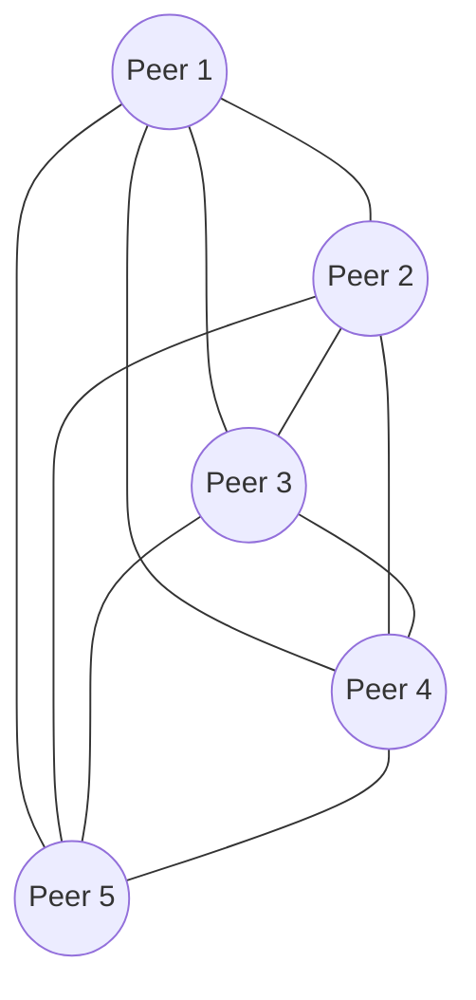
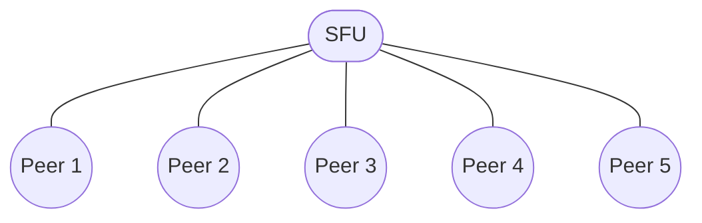

## はじめに

本記事ではブラウザで動作するビデオ通話アプリの実装方法を解説します。実装にあたってはSDKやフレームワークを利用せず、素のJavaScriptで実装します。  
対象読者はWebRTCに触れた経験のない方です。必要な知識は都度説明します。すでに理解されている項目については読み飛ばして構いません。  
本記事で実装するビデオ通話アプリはSTUN / TURN / SFUとしてCloudflare Realtimeを利用します。WebRTCの関連用語については後ほど説明しますので、ご安心ください。  

## Cloudflare Realtimeの概要

Cloudflare Realtimeはビデオ通話などのリアルタイム通信機能を実現するサービスです。以前はCloudflare Callsとよばれていましたが、2025年4月に正式リリースされ、同時にサービス名が変更されました。

リリースブログ

- [（原文）Make your apps truly interactive with Cloudflare Realtime and RealtimeKit - The Cloudflare Blog](https://blog.cloudflare.com/introducing-cloudflare-realtime-and-realtimekit/)
- [（翻訳）Cloudflare RealtimeとRealtimeKitでアプリを本当の意味でインタラクティブに - The Cloudflare Blog](https://www.google.com/search?client=safari&rls=en&q=cloudflare+realtime+release&ie=UTF-8&oe=UTF-8)。

リリースブログで言及されているRealtimeKit SDKについては本記事を投稿した時点で非公開ベータ版です。一般には提供されていません。また、本記事ではRealtimeKitの使い方について解説は行いません。  

### 公式デモアプリ「Orange Meets」

Cloudflare Realtimeを試す方法として、公式のデモアプリ「Orange Meets」は最もお手軽です。以下のURLからアクセスできます。  

https://demo.orange.cloudflare.dev

Orange MeetsはWebアプリケーションとしてCloudflare Workers上にデプロイされています。Cloudflare Realtimeを含め、完全にCloudflareスタックで構築されているのが特徴です。  
ソースコードは以下のリポジトリで公開されています。  

https://github.com/cloudflare/orange

デモアプリとはいえ、Orange Meetsは高機能で細部まで作り込まれています。どこまでがCloudflare Realtimeの機能で、どこからがアプリ固有の機能か、初見で実装を読み解くのは難しいかもしれません。  
補足すると、Orange MeetsはPartyKitとよばれるサードパーティーのSDKを利用して構築されています。PartyKitは高機能なコミュニケーション機能を提供するため、Cloudflare Realtimeの他にCloudflare Durable Objectsを利用して実装されています。  
SDKを使えば、その背後でどのようなサービスが組み合わされて機能が実現されているのか気にする必要はありません。しかし、機能不足に直面したとき、SDKの都合で実装されていないのか、Cloudflare Realtimeの仕様で実現できないのか、調査する必要に迫られます。最初にCloudflare Realtimeの概要を把握して損はありません。  

#### RealtimeKitのリリースを待つべきか？

Cloudflare Realtimeが提供するのはリアルタイム通信機能を構築するための基礎となるサービスのみです。例えば、以下の機能は含まれていません。  

- ユーザー認証機能や多人数通話のルーム機能
- ノイズキャンセル機能や映像・音声の合成機能
- 録音・録画機能

その点はCloudflareも承知しているため、より手軽にCloudflare Realtimeを活用してもらうための公式SDKとしてRealtimeKitを開発しているわけです。RealtimeKitはiOSやAndroidもサポートするクロスプラットフォームなSDKとしてリリースされる予定です。[^1]
ビデオ通話機能を安く手軽に実現する目的であれば、RealtimeKitが正式リリースされるのを待っても良いかもしれません。ただし、記事を投稿した時点ではRealtimeKitの正式リリースがいつになるのか告知はありません。  

### Cloudflare RealtimeはSTUN / TURN / SFUを提供するフルマネージドサービスである

「Cloudflare Realtimeはリアルタイム通信機能を実現するサービスである」そのように説明されても抽象的すぎます。具体的には、何を提供するのでしょうか。  
それでは具体的に説明しましょう。Cloudflare RealtimeはフルマネージドなSTUN / TURN / SFUサーバーを提供します。今度は具体的すぎたでしょうか。  
Cloudflare Realtimeの利用方法を理解するにはWebRTCの知識が必要になります。まずはWebRTCの概要を把握しましょう。  

## WebRTCの概要

WebRTC（Web RealTime Communication）は双方向リアルタイム通信を実現するために策定されたAPIやプロトコルの集合です。技術仕様はRFCとして公開されています。  
ほとんどのブラウザに標準機能として搭載されているため、拡張機能やプラグインを追加せず利用できるのが特徴です。また、Webとは名乗っていますが、その利用はブラウザだけに制限されません。プロトコルに従えばWebブラウザとモバイルアプリの間で通信する、といったことも可能です。  
WebRTCの技術仕様は多岐に渡り、仕様を網羅的に理解するのは困難です。[^1]本記事ではCloudflare Realtimeを利用するために必要となる知識に絞ってWebRTCの基礎を説明します。  

[^1]: WebRTCについての解説記事を見つけた、と思ったら途中で力尽きていました。WebRTC完全理解への道は険しいようです。 https://zenn.dev/yuki_uchida/books/c0946d19352af5/viewer/0e7daa

### WebRTCは可能な限りP2Pで通信するプロトコルである

通信に参加する者をピアとよび、サーバーを介さずピア同士で直接通信する方式をP2P（peer-to-peer）とよびます。WebRTC は可能な限りピア同士で直接通信することを前提にしたプロトコルです  
以降、WebRTCの通信を理解する上で必要となる4つの項目について説明します。  

- STUN
- TURN
- SFU
- シグナリング

### STUNとは

P2P通信を実現するためには、各ピアが自身の「インターネット上で特定可能な住所」、つまりグローバルIPアドレスとポート番号を知る必要があります。しかし、多くのデバイスはルーターやファイアウォールの内側にあり、プライベートIPアドレスしか持っていません。このような環境をNAT（Network Address Translation）環境と呼びます。  
STUN（Session Traversal Utilities for NAT）は、NAT問題を解決するためのプロトコルです。ピアはインターネット上にあるSTUNサーバーに問い合わせることで、自身がNATの内側にある場合でも、NATが割り当てたグローバルIPアドレスとポート番号（NAT外部アドレス）を知ることができます。この情報を相手ピアに伝えることで、P2P通信の確立を試みます。  

### TURNとは

NATの種類によっては、STUNだけではP2P接続を確立できないケースも存在します。そこで活躍するのがTURN（Traversal Using Relays around NAT）です。TURNは、NAT越えが困難な状況下でピア間の通信を中継するプロトコルです。  
具体的には、各ピアはTURNサーバーに対してメディアデータ（音声や映像）を送信し、TURNサーバーがそのデータを相手ピアに転送します。これにより、P2Pで直接通信できないピア同士でも、TURNサーバーを介して間接的にリアルタイム通信を行うことができます。  
もちろん、通信がサーバーを経由するため、P2Pによる直接通信に比べて遅延が大きくなるデメリットがあります。しかし、どのようなネットワーク環境下でも安定した通信を保証するための最終手段として、TURNは欠かせません。  
なお、TURNはP2P通信ができない場合の補助機能であり、TURNの利用は必須ではありません。詳細は後述しますが、Cloudflare Realtimeの場合もTURNを利用するかは開発者側で選択できます。  

### SFUとは

P2Pでビデオ通話を行う場合、参加者が増えるとその複雑さが指数関数的に増大します。例えば、3人でビデオ通話する場合、各ピアは他の2つのピアとそれぞれ接続を確立し、データを送受信する必要があります（合計3接続）。参加者が5人になると、各ピアは4つのピアと接続し、全体では10接続が必要になります。  

図 1. 5人の参加者がお互いに接続されている（メッシュ接続）

このように、参加者が増えるほど接続の管理が難しくなります。この接続方式をメッシュ接続と呼びます。  
SFU（Selective Forwarding Unit）は、多人数接続の課題を解決する手段の一つです。接続の形態については下記の図のような形になります。  

図 2. 5人の参加者がSFUを中心とする星形の接続で結ばれている

SFU方式の場合、各ピアはSFUサーバーとのみ接続を確立します。ピアは自身のメディアストリーム（音声や映像）をSFUサーバーに送信し、SFUサーバーがそのストリームを受信し、他の全てのピアに転送します。  

### シグナリングについて

P2P通信を開始するためには、ピア同士が事前にいくつかの情報を交換する必要があります。この情報交換のプロセスをシグナリングとよびます。  
シグナリングは、いわば「これから通話を始めたいけれど、あなたはどんな設定で話せる？私はこんな感じだよ」とお互いの情報を交換し、合意形成を行うための準備段階です。この準備が整って初めて、実際のメディアデータの送受信が開始されます。  
WebRTCの仕様はシグナリングの伝送経路について規定しておらず、開発者が自由に実装方法を選択できます。一般的にはWebSocketやHTTPが利用されます。  

### シグナリングでやりとりされる情報

シグナリングでやりとりされる情報は以下の2つです。

1. ICE候補
2. SDP

それぞれの概要を説明した後、シグナリングの流れを説明します。

#### ICE候補とは

ICE（Interactive Connectivity Establishment）候補は、ピアが通信に利用できる可能性のあるIPアドレスとポート番号の組み合わせです。STUNサーバーから取得したNAT外部アドレスや、TURNサーバーから取得したリレーアドレスなどが含まれます。  
「ICE」ではなく「ICE候補」とよばれているのは、試してみなければ通信が成功するかはわからないためです。STUN / TURNの項目で説明したとおり、ネットワークの環境によってはP2P通信ができない可能性があります。  
そこで、1つ目のICE候補で通信を試し、通信できなければ2つ目のICE候補を試し、通信できなければ3つ目のICE候補を試し......、といった具合に、次々と候補を試します。  

#### SDPとは

シグナリングで交換される情報の内、メディアに関連するものをSDP（Session Description Protocol）とよびます。具体的には次のような情報がSDPに含まれます。  

- 使用する音声や映像のコーデック
- 解像度やフレームレート
- 送信するメディアトラックの種類（音声のみ、映像のみ、音声と映像など）。

#### シグナリングの流れ

シグナリングは以下の流れで行われます。ここでは、例としてAliceとBobの2人が双方向に通信する場合を想定して説明します。

Aliceを起点としたシグナリングの流れ

1. AliceはBobにSDPを送信する。
2. BobはAliceにSDPを応答する。
3. 両者のSDPの最大公約数で通信を開始する。

もう少し噛み砕いて例示すると、以下のようになります。

1. Alice「私はVP9とH.264コーデックで話せるわ。どうかしら？」
2. Bob「僕はH.264とAV1コーデックで話ができるよ。どうかな？」
3. Alice「それじゃ、H.264コーデックを使って話をしましょう。」

さらに、ブラウザ上で実行される処理について具体的に説明すると、以下のようになります。

1. Aliceは以下の処理を行う。
    - RTCPeerConnectionの`createOffer()`でSDPを作成する。
    - 作成したSDPについて、RTCPeerConnectionの`setLocalDescription()`で自分自身のSDPとして設定する。
2. Bobは以下の処理を行う。
    - Aliceから受け取ったSDPについて、RTCPeerConnectionの`setRemoteDescription()`で相手側SDPとして設定する。
    - RTCPeerConnectionの`createAnswer()`で応答用のSDPを作成する。
    - 応答用のSDPについて、RTCPeerConnectionの`setLocalDescription()`で自分自身のSDPとして設定する。
3. Aliceは以下の処理を行う。
    - Bobから受け取ったSDPについて、RTCPeerConnectionの`setRemoteDescription()`で相手側SDPとして設定する。
    - この時点でお互いがどのようなメディアを送受信するか合意できたため、双方向で通信が可能になる。

以上がシグナリングの流れになります。特に、上記の手順1で送信されるSDPはOffer SDP、手順2で送信されるSDPはAnswer SDPとよばれます。  
なお、説明を簡素にするためICE候補については触れていませんが、ICE候補はSDPと同時に送信されます。通信が成功するか試しつつSDPの送信をこころみているわけです。   

## ビデオ通話アプリの実装

ここからが本題です。Cloudflare Realtimeを利用したビデオ通話アプリを実装します。完成したアプリの実装は以下のリポジトリで公開しています。  

https://github.com/moutend/rtcdemo

### Cloudflare RealtimeにおけるApplication / Session / Trackについて
### 動作確認後のアプリ削除について

本記事で実装するビデオ通話アプリはあくまでサンプルです。ユーザー認証機能がありません。デプロイされたURLを知っている人であれば誰でも利用できます。  
また、今回の実装は動作の仕組みが理解できることを優先するため、Cloudflare Realtimeシークレットをクライアント側のJavaScriptに埋め込みます。本来、シークレットが漏洩するような方法で実装を行ってはいけません。  
従って、動作確認が終わった後にアプリを削除せず放置していると、意図せず利用されて課金される恐れがあります。手順については削除方法の章で説明しますので、指示に従ってください。  

## 参考文献

1. [Introduction to the Real-time Transport Protocol (RTP) - Web APIs - MDN](https://developer.mozilla.org/en-US/docs/Web/API/WebRTC_API/Intro_to_RTP)
